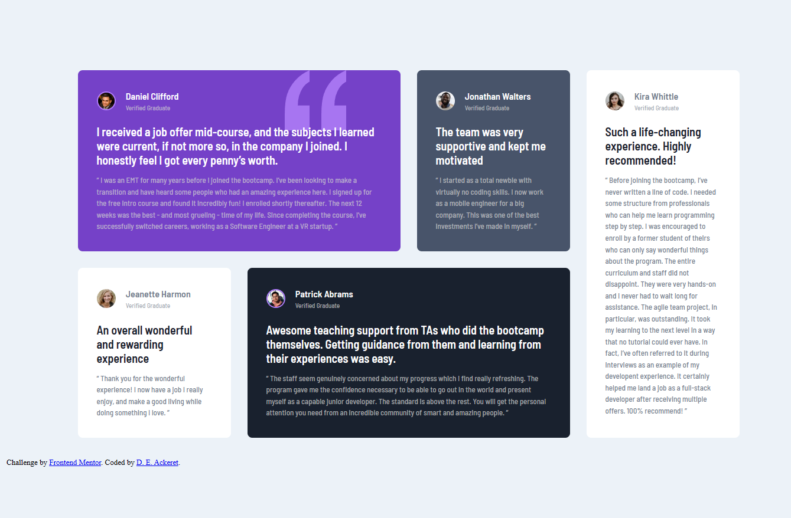
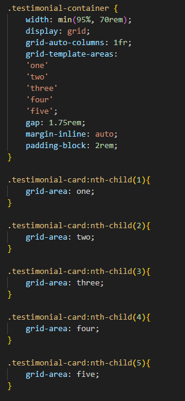
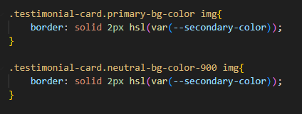

# Frontend Mentor - Testimonials grid section solution

This is a solution to the [Testimonials grid section challenge on Frontend Mentor](https://www.frontendmentor.io/challenges/testimonials-grid-section-Nnw6J7Un7). Frontend Mentor challenges help you improve your coding skills by building realistic projects. 

## Table of contents

- [Overview](#overview)
  - [The challenge](#the-challenge)
  - [Screenshot](#screenshot)
  - [Links](#links)
- [My process](#my-process)
  - [Built with](#built-with)
  - [What I learned](#what-i-learned)
  - [Continued development](#continued-development)
  - [Useful resources](#useful-resources)
- [Author](#author)
- [Acknowledgments](#acknowledgments)

## Overview

### The challenge

Creating a responsive layout for all screen sizes with CSS grid.

### Screenshot

### Links

- Solution URL: 
- Live Site URL: 

## My process

I took on this project to learn CSS grid. Kevin Powell, a Youtuber, has a really good video following this project (that can be found here https://www.youtube.com/watch?v=rg7Fvvl3taU&t=94s). I followed along for the CSS grid portion with a fork off one of his repositories. After learing how to use grid, I decided to take on the whole project. I attemped to try recreating the project myself in sections and then would cross reference to his repository to see how he did it and compare the two solutions. I ended up adopting some of the techinques he used and learned a great deal from the process. I have been having trouble with responsivness and Kevins video/respository was very helpful in not only teaching me about grid but also how a developer in the industry approaches projects like this. Aside from grid, I also learned about selector heirarchy. Understanding the specificity score really helped me to style specific elements. I even learned that you can specify the same class twice (although I dont know if that is wise for maintaining the site long term.) 

### Built with

- Semantic HTML5 markup
- CSS custom properties
- CSS Grid
- CSS Grid areas

### What I learned

This snippet shows the creation of my grid template area and then the assignments within that area with the testimonial-card children. I really like the control this gave me and with my dev tools, how easy it was to visualize the grid. I also need to make sure I remember grid-auto-columns so I can have things spaced neatly. 

This snippet goes back to what I was talking about with the specificity score. I didn't want to have to add any more classes, esspecially for only one style change. I used what I learned and was able to target the elements because of their unique background styles via their utility classes. 

### Continued development

Moving forward I want to practice grid more so that I can be confident in responsive design. I am interested in figuring out how I might use grid when there are changes to the dom. Overall I am very grateful for everything I learned in this project and want to take those skills and apply them on my own projects in the future. 

### Useful resources

- [Kevin Powell Youtube](https://www.youtube.com/watch?v=rg7Fvvl3taU&t=94s) - Very helpful youtube video for learning CSS grid.
- [Kevin Powell Repository](https://github.com/kevin-powell/learn-grid-the-easy-way) - This is the repository I learned from too.

## Author

- Website - [GitHub Repo](https://www.your-site.com)
- Frontend Mentor - [@DEAckeret](https://www.frontendmentor.io/profile/DEAckeret)

## Acknowledgments

Of course I would like to thank Kevin Powell for his video and repository. I learned so much from each of them and feel more confident in building responsive applications. Before this project I had very little knowelge of CSS grid but now I feel like I will frequently use it in all my projects.
